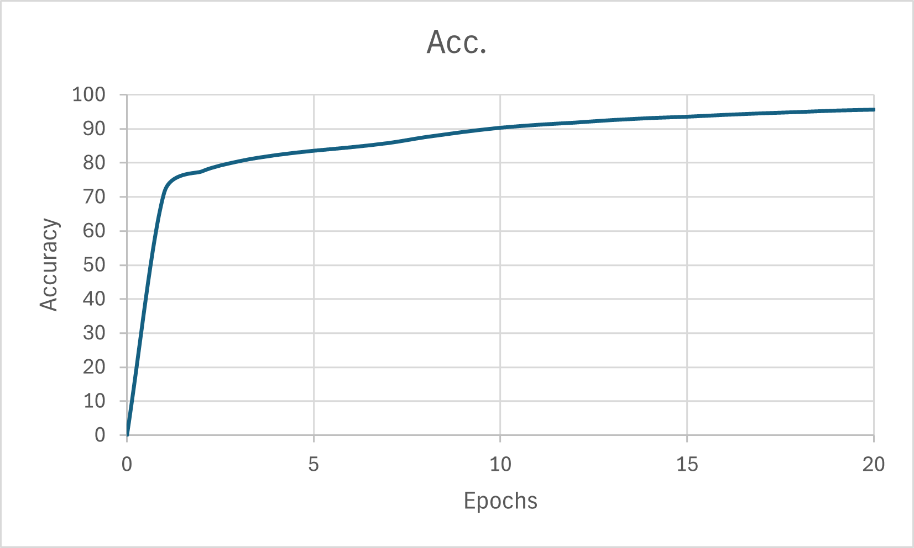
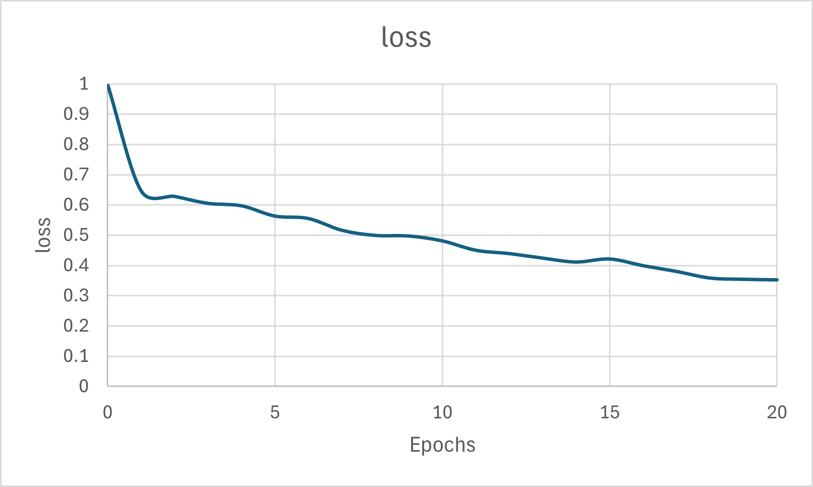

# U_Net from scratch for Image-Segmentation

This repository contains a PyTorch implementation of the U-Net architecture from scratch for image segmentation, along with the necessary dataset handling and utility functions.


## Project Structure
```
├── u_net.py            # U-Net model architecture
├── dataset.py          # Dataset class for loading images and masks
├── utils.py            # Utility functions for training and evaluation
├── train.py            # Training script
├── data/               # Directory containing training and validation images and masks
│   ├── train_images/
│   ├── train_masks/
│   ├── val_images/
│   └── val_masks/
├── saved_images/       # Directory to save prediction images
└── my_checkpoint.pth.tar # Checkpoint file for saving and loading model states
```

### Prerequisites

```
- Python 3.7 or later
- PyTorch
- torchvision
- albumentations
- tqdm
- PIL (Python Imaging Library)
```

## Installing Dependencies
You can install the required dependencies using pip:
```
pip install torch torchvision albumentations tqdm pillow
```


## Dataset
Download the Carvana dataset and split the dataset into train and validation sets in the ratio of `95%-5%` or `90%-10%`.
The dataset is expected to be in the data/ directory with the following structure:

```
data/
├── train_images/
├── train_masks/
├── val_images/
└── val_masks/
```

- train_images/ : should contain the training images.
- train_masks/  : should contain the corresponding masks for the training images.
- val_images/   : should contain the validation images.
- val_masks/    : should contain the corresponding masks for the validation images.


## Training
The training script includes hyperparameters and paths defined at the top. Adjust them as necessary.
You can start the training process by running the train.py script:

```
python train.py
```


## Results:


<p align="center">
   
</p>

<p align="center">
   
</p>


## Customizing Transformations
The albumentations library is used for data augmentation. The transformations are defined in the train.py file and can be customized as needed.

```
train_transform = A.Compose(
    [
        A.Resize(height=IMAGE_HEIGHT, width=IMAGE_WIDTH),
        A.Rotate(limit=35, p=1.0),
        A.HorizontalFlip(p=0.5),
        A.VerticalFlip(p=0.1),
        A.Normalize(
            mean=[0.0, 0.0, 0.0],
            std=[1.0, 1.0, 1.0],
            max_pixel_value=255.0,
        ),
        ToTensorV2(),
    ],
)

```


## Checkpointing and Evaluation
During training, the model checkpoints are saved periodically. The model can be loaded from a checkpoint using the LOAD_MODEL flag in train.py.

The script also includes functions to evaluate the model and save predictions:

```
# Save model checkpoint
save_checkpoint(checkpoint)

# Check accuracy on validation set
check_accuracy(val_loader, model, device=DEVICE)

# Save example predictions
save_predictions_as_imgs(val_loader, model, folder="saved_images/", device=DEVICE)

```


